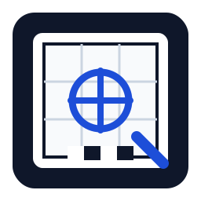
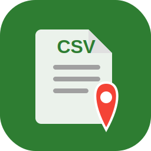
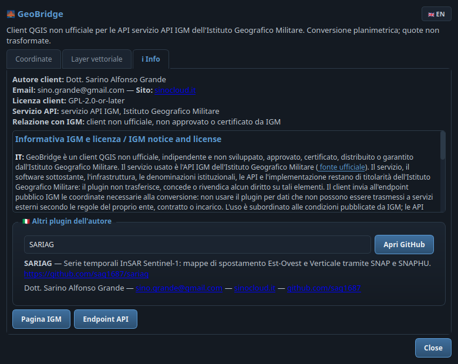
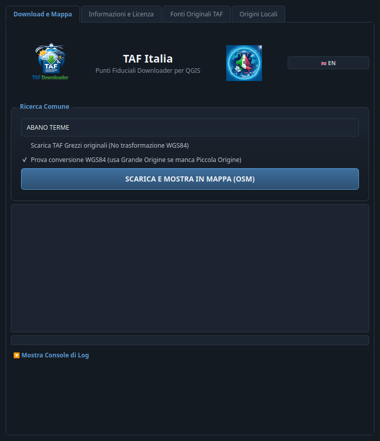

<div align="center">

# 🗺️ Repository Plugin QGIS

### Dott. Sarino Alfonso Grande · [SinoCloud](https://sinocloud.it)

   

Repository personalizzato per il **Plugin Manager di QGIS**: si aggiunge una
volta sola, poi installazione e aggiornamenti avvengono direttamente da QGIS.

*Custom repository for the **QGIS Plugin Manager**: add it once, then install
and update the plugins directly from QGIS.*

```text
https://sag1687.github.io/sarinoalfonsogrande/plugins.xml
```

[📦 Installazione](#-installazione--installation) ·
[🧩 Plugin](#-plugin-disponibili--available-plugins) ·
[🔄 Aggiornamenti](#-aggiornamenti--updates) ·
[🆘 Supporto](#-supporto--support)

</div>

---

## 📦 Installazione / Installation

| Passo | 🇮🇹 Italiano | 🇬🇧 English |
|:---:|---|---|
| 1 | Apri **Plugins → Gestisci e installa plugin → Impostazioni** | Open **Plugins → Manage and Install Plugins → Settings** |
| 2 | In **Repository dei plugin** premi **Aggiungi** | Under **Plugin Repositories** click **Add** |
| 3 | Nome: `SinoCloud` — URL: `https://sag1687.github.io/sarinoalfonsogrande/plugins.xml` | Name: `SinoCloud` — URL: `https://sag1687.github.io/sarinoalfonsogrande/plugins.xml` |
| 4 | Conferma: i plugin compaiono nel Plugin Manager | Confirm: the plugins appear in the Plugin Manager |

> [!TIP]
> In alternativa scarica lo `zip` di un singolo plugin e installalo da
> **Plugins → Gestisci e installa plugin → Installa da ZIP**.
> *Alternatively download a single plugin `zip` and install it via
> **Plugins → Manage and Install Plugins → Install from ZIP**.*

## 🧩 Plugin disponibili / Available plugins

<table>
  <thead>
    <tr>
      <th></th><th>Plugin</th><th>Versione</th><th>QGIS</th>
      <th>Descrizione / Description</th><th>Zip</th>
    </tr>
  </thead>
  <tbody>
    <tr>
      <td align="center"></td>
      <td><a href="#q_press"><b>Q-Press</b></a></td>
      <td align="center"><code>2.1.1</code></td>
      <td align="center">3.16+</td>
      <td>Genera PDF cartografici professionali dall'area selezionata sul canvas con Shift+trascina: scala, griglie,…</td>
      <td align="center"><a href="zips/q_press.zip">⬇️</a></td>
    </tr>
    <tr>
      <td align="center"></td>
      <td><a href="#crs"><b>Quick CRS Fixer</b></a></td>
      <td align="center"><code>2.1.1</code></td>
      <td align="center">3.16+</td>
      <td>Rileva e corregge automaticamente i problemi di sistema di riferimento (CRS) dei layer, con suggerimento…</td>
      <td align="center"><a href="zips/crs.zip">⬇️</a></td>
    </tr>
    <tr>
      <td align="center"></td>
      <td><a href="#geobridge"><b>GeoBridge</b></a></td>
      <td align="center"><code>1.3.0</code></td>
      <td align="center">3.22+</td>
      <td>Client non ufficiale per le API IGM: conversione di coordinate e layer vettoriali tra datum italiani</td>
      <td align="center"><a href="zips/geobridge.zip">⬇️</a></td>
    </tr>
    <tr>
      <td align="center"></td>
      <td><a href="#qgis_ledger"><b>QGIS Ledger</b></a></td>
      <td align="center"><code>4.2.1</code></td>
      <td align="center">3.0+</td>
      <td>Controllo di versione stile Git per progetti QGIS: diff geometrici, rollback e sincronizzazione multi-cloud</td>
      <td align="center"><a href="zips/qgis_ledger.zip">⬇️</a></td>
    </tr>
    <tr>
      <td align="center"></td>
      <td><a href="#csv_importer_plugin"><b>GeoCSV Mapper</b></a></td>
      <td align="center"><code>2.3.1</code></td>
      <td align="center">3.0+</td>
      <td>Importa CSV con coordinate in vari formati (incluso DMS), anteprima mappa e salvataggio in GeoPackage</td>
      <td align="center"><a href="zips/csv_importer_plugin.zip">⬇️</a></td>
    </tr>
    <tr>
      <td align="center"></td>
      <td><a href="#sar"><b>STAC Browser</b></a></td>
      <td align="center"><code>1.7.0</code></td>
      <td align="center">3.16+</td>
      <td>Cerca e scarica dati di osservazione della Terra dai cataloghi STAC disegnando un'area o cercando un indirizzo</td>
      <td align="center"><a href="zips/SAR.zip">⬇️</a></td>
    </tr>
    <tr>
      <td align="center"></td>
      <td><a href="#sariag"><b>SARIAG</b></a> ⚠️</td>
      <td align="center"><code>0.3.1</code></td>
      <td align="center">3.16+</td>
      <td>Serie temporali InSAR da Sentinel-1 con SNAP: mappe di spostamento Est-Ovest e Verticale</td>
      <td align="center"><a href="zips/SARIAG.zip">⬇️</a></td>
    </tr>
    <tr>
      <td align="center"></td>
      <td><a href="#qgis_taf_plugin"><b>TAF Italia</b></a> ⚠️</td>
      <td align="center"><code>2.7.1</code></td>
      <td align="center">3.10+</td>
      <td>Scarica e converte i Punti Fiduciali (TAF) dell'Agenzia delle Entrate in CSV/GeoPackage WGS84</td>
      <td align="center"><a href="zips/QGIS_TAF_Plugin.zip">⬇️</a></td>
    </tr>
  </tbody>
</table>

⚠️ = sperimentale / *experimental*

## 🔍 Dettagli / Details

### <a name="q_press"></a> Q-Press

  

🇮🇹 Genera PDF cartografici professionali dall'area selezionata sul canvas con Shift+trascina: scala, griglie, legenda, tabelle e profilo topografico.

🇬🇧 Generate professional cartographic PDFs from the canvas area selected with Shift+drag: scale, grids, legend, tables and topographic profile.

<details>
<summary><b>Maggiori informazioni / More info</b></summary>

Q-Press allows you to select an area directly from the QGIS canvas using Shift+Drag and instantly generate a professional cartographic PDF. The output includes a technical title block, automatic or manual scale, custom paper size, coordinate grids, legend, overview map, filtered attribute tables, statistical dashboards, and a single-line topographic profile from OpenTopoData or a project DTM/DEM raster.

</details>


<details>
<summary><b>Altri screenshot / More screenshots</b></summary>


</details>

| | |
|---|---|
| 📦 **Download** | [`q_press.zip`](zips/q_press.zip) |
| 💻 **Codice sorgente** | https://github.com/sag1687/q_press |
| 🐞 **Bug tracker** | https://github.com/sag1687/q_press/issues |
| 👤 **Autore** | Dott. Sarino Alfonso Grande |
| 🌐 **Sito** | https://sinocloud.it |

### <a name="crs"></a> Quick CRS Fixer

  

🇮🇹 Rileva e corregge automaticamente i problemi di sistema di riferimento (CRS) dei layer, con suggerimento EPSG intelligente.

🇬🇧 Automatically detects and fixes layer coordinate reference system (CRS) issues, with smart EPSG suggestions.

<details>
<summary><b>Maggiori informazioni / More info</b></summary>

🇮🇹 Quick CRS Fixer è un plugin essenziale per individuare e risolvere problematiche legate ai Sistemi di Riferimento delle Coordinate (CRS). Funzionalità principali: rilevamento automatico delle incongruenze geometriche; suggerimento intelligente dell'EPSG corretto tramite toponimi ed estensione spaziale; integrazione con OpenStreetMap (Nominatim) e Wikipedia; scheda Help; selettore lingua italiano/inglese. Compatibile con QGIS 3.x e QGIS 4.0+/Qt6. Sviluppato per ricerca e utilità pubblica.

🇬🇧 Quick CRS Fixer is an essential plugin for identifying and resolving Coordinate Reference System (CRS) issues. Key features: automatic detection of geometric inconsistencies; smart EPSG suggestions through place names and spatial extents; OpenStreetMap (Nominatim) and Wikipedia integration; Help tab; Italian/English language selector. Compatible with QGIS 3.x and QGIS 4.0+/Qt6. Developed for research and public utility.

</details>


<details>
<summary><b>Altri screenshot / More screenshots</b></summary>


</details>

| | |
|---|---|
| 📦 **Download** | [`crs.zip`](zips/crs.zip) |
| 💻 **Codice sorgente** | https://github.com/sag1687/CRS_FIXER |
| 🐞 **Bug tracker** | https://github.com/sag1687/CRS_FIXER/issues |
| 👤 **Autore** | Dott. Sarino Alfonso Grande |
| 🌐 **Sito** | https://sinocloud.it |

### <a name="geobridge"></a> GeoBridge

  

🇮🇹 Client non ufficiale per le API IGM: conversione di coordinate e layer vettoriali tra datum italiani.

🇬🇧 Unofficial client for the IGM API: coordinate and vector layer conversion between Italian datums.

<details>
<summary><b>Maggiori informazioni / More info</b></summary>

IT: GeoBridge e' un client QGIS non ufficiale. Il codice del plugin e' distribuito sotto licenza GPL-2.0-or-later. IMPORTANTE: L'autore non si appropria ne' rivendica alcun diritto sui prodotti IGM. Il servizio API IGM, l'infrastruttura, il marchio e le elaborazioni sono e restano di esclusiva proprieta' dell'Istituto Geografico Militare. Sviluppo coadiuvato da AI. EN: GeoBridge is an unofficial QGIS client. The plugin code is licensed under GPL-2.0-or-later. IMPORTANT: The author does not appropriate or claim any rights over IGM products. The servizio API IGM service, infrastructure, brand, and processing results are and remain the exclusive property of the Italian Military Geographic Institute. Development assisted by AI.

</details>


<details>
<summary><b>Altri screenshot / More screenshots</b></summary>



</details>

| | |
|---|---|
| 📦 **Download** | [`geobridge.zip`](zips/geobridge.zip) |
| 💻 **Codice sorgente** | https://github.com/sag1687/geobridge |
| 🐞 **Bug tracker** | https://github.com/sag1687/geobridge/issues |
| 👤 **Autore** | Dott. Sarino Alfonso Grande |
| 🌐 **Sito** | https://sinocloud.it |

### <a name="qgis_ledger"></a> QGIS Ledger

  

🇮🇹 Controllo di versione stile Git per progetti QGIS: diff geometrici, rollback e sincronizzazione multi-cloud.

🇬🇧 Git-like version control for QGIS projects: geometric diffs, rollback and multi-cloud sync.

<details>
<summary><b>Maggiori informazioni / More info</b></summary>

============================================================
ITALIANO
============================================================
QGIS Ledger — Versioning di Livello Enterprise per QGIS
Sistema di tracciamento storico e sincronizzazione cloud progettato per l'integrità dei dati spaziali, senza dipendenze esterne. Ottimizzato per QGIS 3.x e QGIS 4 (Qt6).

FUNZIONALITÀ PRINCIPALI:
- Architettura a Snapshot: Commit atomici di layer e progetti in SQLite locale.
- Diff Semantico-Visuale: Analisi geometrica delle differenze tra versioni.
- Rollback Deterministico: Ripristino istantaneo di dati e stili.
- Sincronizzazione Cloud: Supporto nativo per Nextcloud, WebDAV, Dropbox, OneDrive e GDrive.
- Merge Wizard: Gestione conflitti in split-screen.

============================================================
ENGLISH
============================================================
QGIS Ledger — Enterprise-Grade Version Control for QGIS
Comprehensive historical tracking and cloud synchronization engine engineered for geospatial data integrity, operating entirely dependency-free across QGIS 3.x and QGIS 4 (Qt6).

CORE FEATURES:
- Snapshot Architecture: Atomic commits of layers and projects in local SQLite.
- Semantic Visual Diff: Geometric analysis of differences between versions.
- Deterministic Rollback: Instant restoration of data and styling.
- Cloud Synchronization: Native support for Nextcloud, WebDAV, Dropbox, OneDrive, and GDrive.
- Merge Wizard: Split-screen conflict resolution.

</details>

| | |
|---|---|
| 📦 **Download** | [`qgis_ledger.zip`](zips/qgis_ledger.zip) |
| 💻 **Codice sorgente** | https://github.com/sag1687/qgis_ledger |
| 🐞 **Bug tracker** | https://github.com/sag1687/qgis_ledger/issues |
| 👤 **Autore** | Dott. Sarino Alfonso Grande |
| 🌐 **Sito** | https://sinocloud.it |

### <a name="csv_importer_plugin"></a> GeoCSV Mapper

  

🇮🇹 Importa CSV con coordinate in vari formati (incluso DMS), anteprima mappa e salvataggio in GeoPackage.

🇬🇧 Import CSV files with coordinates in various formats (DMS included), map preview and GeoPackage export.

<details>
<summary><b>Maggiori informazioni / More info</b></summary>

IT: Questo plugin è uno strumento avanzato per l'importazione massiva di punti tramite file CSV in QGIS.\nOffre un potente parser per il riconoscimento automatico sia delle coordinate decimali standard sia dei formati sessagesimali complessi (DMS). Implementa un'anteprima rapida su cartografia OpenStreetMap, verifica in tempo reale la codifica testuale e supporta l'esportazione automatizzata verso il moderno formato standard GeoPackage.\n\nEN: This plugin is an advanced tool for the bulk import of points via CSV files in QGIS.\nIt offers a powerful parser for automatic recognition of both standard decimal coordinates and complex sexagesimal formats (DMS). It features a quick preview on OpenStreetMap cartography, real-time text encoding verification, and automated export support to the modern GeoPackage format.

</details>


<details>
<summary><b>Altri screenshot / More screenshots</b></summary>


</details>

| | |
|---|---|
| 📦 **Download** | [`csv_importer_plugin.zip`](zips/csv_importer_plugin.zip) |
| 💻 **Codice sorgente** | https://github.com/sag1687/GeoCSV-Mapper |
| 🐞 **Bug tracker** | https://github.com/sag1687/GeoCSV-Mapper/issues |
| 👤 **Autore** | Dott. Sarino Alfonso Grande e Geometra Luca Casti |
| 🌐 **Sito** | https://sinocloud.it |

### <a name="sar"></a> STAC Browser

  

🇮🇹 Cerca e scarica dati di osservazione della Terra dai cataloghi STAC disegnando un'area o cercando un indirizzo.

🇬🇧 Search and download Earth-observation data from STAC catalogs by drawing an area or searching an address.

<details>
<summary><b>Maggiori informazioni / More info</b></summary>

🇮🇹 Trova dati di osservazione della Terra liberi e gratuiti disegnando un rettangolo, un punto o una linea sulla mappa, oppure digitando un indirizzo (geocoding Nominatim). La ricerca automatica interroga tutti i cataloghi STAC e mostra solo i dataset realmente presenti per quell'area, organizzati per tipo dato (ortofoto, 1/2/3 bande, multispettrale, DEM, radar) con timeline, schede adattive, modali dettagli, scelta delle bande COG da scaricare (tutte o solo alcune) e confronto NDVI/NDWI/Falso Colore. Gli indici sono opt-in: richiedono un flag esplicito, vengono salvati come GeoTIFF locale e mostrano il tempo di download/elaborazione.

🇬🇧 Find free and open Earth-observation data by drawing a rectangle, point or line on the map, or by typing an address (Nominatim geocoding). Automatic search queries every STAC catalog and shows only datasets that actually exist for that area, grouped by data type (orthophoto, 1/2/3 bands, multispectral, DEM, radar) with timeline, adaptive cards, details dialogs, selectable COG band download (all or only some) and NDVI/NDWI/False Color comparison. Indices are opt-in: they require an explicit flag, are saved as local GeoTIFFs and show download/processing time. Catalogs: Element84 Earth Search, Microsoft Planetary Computer, USGS LandsatLook, NASA EarthData CMR, OpenLandMap, US GeoPlatform, Copernicus Data Space, Digital Earth Australia.

</details>


<details>
<summary><b>Altri screenshot / More screenshots</b></summary>


</details>

| | |
|---|---|
| 📦 **Download** | [`SAR.zip`](zips/SAR.zip) |
| 💻 **Codice sorgente** | https://github.com/sag1687/stac_browser |
| 🐞 **Bug tracker** | https://github.com/sag1687/stac_browser/issues |
| 👤 **Autore** | Dott. Sarino Alfonso Grande |
| 🌐 **Sito** | https://sinocloud.it |

### <a name="sariag"></a> SARIAG

   

> [!WARNING]
> **Plugin sperimentale** — in QGIS è visibile solo attivando *"Mostra anche i plugin sperimentali"* nelle impostazioni del Plugin Manager.
> *Experimental plugin — visible in QGIS only when "Show also experimental plugins" is enabled in the Plugin Manager settings.*

🇮🇹 Serie temporali InSAR da Sentinel-1 con SNAP: mappe di spostamento Est-Ovest e Verticale.

🇬🇧 Sentinel-1 InSAR time series with SNAP: East-West and Vertical displacement maps.

<details>
<summary><b>Maggiori informazioni / More info</b></summary>

🇮🇹 SARIAG automatizza dentro QGIS un flusso InSAR multi-temporale (tipo SBAS): cerca e scarica scene Sentinel-1 SLC dal Copernicus Data Space Ecosystem per un'area di interesse, sia in orbita ascendente sia discendente, pilota il Graph Processing Tool (gpt) di ESA SNAP per coregistrazione, formazione degli interferogrammi, filtraggio e unwrapping di fase (via SNAPHU), inverte la rete a baseline corta in una serie temporale di spostamento lungo la linea di vista (LOS) per ciascuna data, e scompone i risultati ascendente+discendente in mappe di spostamento Est-Ovest e Verticale caricate direttamente in QGIS. Richiede un'installazione locale di ESA SNAP (con il plugin di unwrapping SNAPHU) e un account gratuito Copernicus Data Space Ecosystem; SARIAG orchestra questi strumenti collaudati invece di reimplementare da zero l'unwrapping di fase.

🇬🇧 SARIAG automates a multi-temporal InSAR (SBAS-style) workflow inside QGIS: it searches and downloads Sentinel-1 SLC scenes from the Copernicus Data Space Ecosystem for an area of interest, both ascending and descending orbit passes, drives ESA SNAP's Graph Processing Tool (gpt) to coregister, form interferograms, filter and unwrap phase (via SNAPHU), inverts the small-baseline network into per-date line-of-sight displacement time series, and decomposes the ascending+descending LOS results into East-West and Vertical displacement maps loaded directly into QGIS. Requires a local ESA SNAP installation (with the SNAPHU unwrapping plugin) and a free Copernicus Data Space Ecosystem account; SARIAG orchestrates these proven tools rather than reimplementing phase unwrapping from scratch.

</details>


<details>
<summary><b>Altri screenshot / More screenshots</b></summary>


</details>

| | |
|---|---|
| 📦 **Download** | [`SARIAG.zip`](zips/SARIAG.zip) |
| 💻 **Codice sorgente** | https://github.com/sag1687/sariag |
| 🐞 **Bug tracker** | https://github.com/sag1687/sariag/issues |
| 👤 **Autore** | Dott. Sarino Alfonso Grande |
| 🌐 **Sito** | https://sinocloud.it |

### <a name="qgis_taf_plugin"></a> TAF Italia

   

> [!WARNING]
> **Plugin sperimentale** — in QGIS è visibile solo attivando *"Mostra anche i plugin sperimentali"* nelle impostazioni del Plugin Manager.
> *Experimental plugin — visible in QGIS only when "Show also experimental plugins" is enabled in the Plugin Manager settings.*

🇮🇹 Scarica e converte i Punti Fiduciali (TAF) dell'Agenzia delle Entrate in CSV/GeoPackage WGS84.

🇬🇧 Downloads and converts Italian Revenue Agency Fiducial Points (TAF) into WGS84 CSV/GeoPackage.

<details>
<summary><b>Maggiori informazioni / More info</b></summary>

ITA: TAF Italia automatizza il download dei Punti Fiduciali catastali dall'Agenzia delle Entrate, li converte dal sistema Cassini-Soldner/Gauss-Boaga al WGS84 (EPSG:4326) e li esporta in formato CSV caricabile direttamente in QGIS. ATTENZIONE: i dati potrebbero contenere punti outlier dovuti a errori nella conversione delle coordinate originali. Il plugin determina il sistema di riferimento dal valore della coordinata Est (soglie Gauss-Boaga Ovest/Est, Cassini-Soldner). Le coordinate Cassini-Soldner usano il modello delle 31 Grandi Origini nazionali, non le singole origini comunali, con possibili scostamenti di decine di metri. Include un editor visivo di origini locali (export template CSV, import da file, salvataggio configurazione), generazione automatica link monografie, tematizzazione QGIS (triangolo verde, label PF/FG/COM, azione apertura browser) e mappa interattiva OSM. ENG: TAF Italia automates the download of cadastral Fiducial Points from the Italian Revenue Agency, converts them from Cassini-Soldner/Gauss-Boaga to WGS84 (EPSG:4326) and exports them as CSV files directly loadable in QGIS. WARNING: data may contain outlier points due to errors in the original coordinate conversion. The plugin detects the CRS from the Easting value thresholds. Cassini-Soldner coordinates use the 31 Great National Origins model, not single municipal origins, with possible deviations of tens of meters. Includes a visual local origins editor, automatic monografia link generation, QGIS styling (green triangle, PF/FG/COM labels, browser action) and interactive OSM map.

</details>



<details>
<summary><b>Altri screenshot / More screenshots</b></summary>


</details>

| | |
|---|---|
| 📦 **Download** | [`QGIS_TAF_Plugin.zip`](zips/QGIS_TAF_Plugin.zip) |
| 💻 **Codice sorgente** | https://github.com/sag1687/TAF_ITALIA_DOWNLOAD |
| 🐞 **Bug tracker** | https://github.com/sag1687/TAF_ITALIA_DOWNLOAD/issues |
| 👤 **Autore** | Dott. Sarino Alfonso Grande |
| 🌐 **Sito** | https://sinocloud.it |


## 🔄 Aggiornamenti / Updates

🇮🇹 Quando viene pubblicata una nuova versione, QGIS la segnala automaticamente
nel Plugin Manager (scheda *Aggiornabili*) a chiunque abbia aggiunto questo
repository: non serve scaricare nulla a mano.

🇬🇧 *When a new version is published, QGIS automatically reports it in the
Plugin Manager ("Upgradeable" tab) to anyone who added this repository — no
manual download needed.*

## 🆘 Supporto / Support

🇮🇹 Per segnalazioni e richieste usa il **bug tracker** del singolo plugin
(link nelle sezioni sopra) oppure scrivi a **sino.grande@gmail.com**.

🇬🇧 *For issues and requests use the plugin's **bug tracker** (links in the
sections above) or write to **sino.grande@gmail.com**.*

## 📄 Licenza / License

🇮🇹 Tutti i plugin sono rilasciati con licenza **GPL-2.0**; il testo completo è
incluso in ogni pacchetto.
🇬🇧 *All plugins are released under the **GPL-2.0** license; the full text is
included in every package.*

---

<div align="center">

**[sinocloud.it](https://sinocloud.it)** · sino.grande@gmail.com

<sub>README generato automaticamente dai <code>metadata.txt</code> dei plugin —
ultimo aggiornamento / last update: 13/07/2026</sub>

</div>
